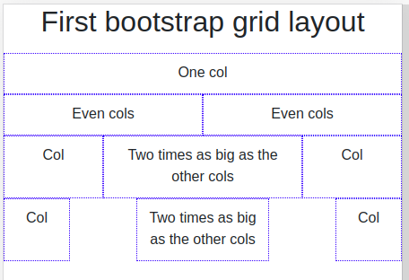

# Bootstrap - Exercise #3 - Grid intro

## Instructions

- Create a grid like in the image below
- Use the bootstrap classes: container, row, col and col-*
- Center the text contents of the container
  - Lookup the section "Utilities" > "Text" on the bootstrap page and find out the needed class to put on the container

Result:

