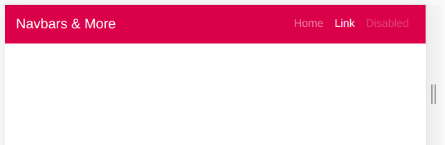

# Bootstrap - Exercise #7 - Navbar

Create a responsive navbar like shown below:

Default (collapsed):

Starting from small mobile (>=576px):

Info page on Bootstrap navbar & Colors:
<https://getbootstrap.com/docs/4.3/components/navbar>
<https://getbootstrap.com/docs/4.3/utilities/colors/>
