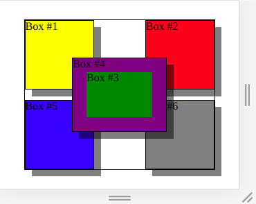

# Exercise Positioning - Z-Index #1

Find attached the given html file.

It currently shows a layering of boxes like this:

It should get updated to this layering of boxes:

The main differences to realize in the result:

- the boxes have shadows (not blurred)
- the sub-container box (containing the boxes 3 and 4) needs to be on top of all other boxes
- the hidden box 3 (green) needs to be placed on top of box 4. The green frame around should be 20px (don't use percentages).

