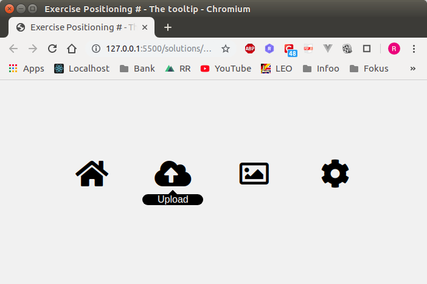

# Exercise # Positioning - the tooltip menu

Within the given file index.html you find a menu with four menu boxes.

Each menu box consists of one fontawesome icon + an icon label (within the span tag).

Please adjust the css so that the icon label is hidden by default and is shown by hovering over the icon.

Additionally: Place a small triangle shape on top of the span. Use a pseudo element for that and position it absolutely.

Please leave the z-index property within the file untouched, it has its purpose :)

Make the article titles occupy 10% of its container width. The section should have 10% space to the left.

Make the article headers stick within its container when scrolling.
