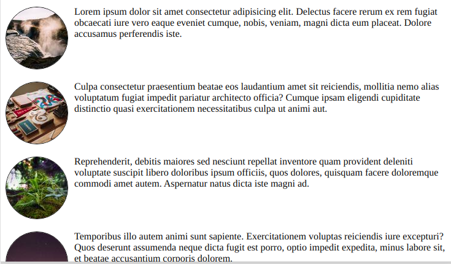

# Shapes - Exercise 1 - The rounded image gallery

We have an index.html with just some basic CSS and no content in the 
HTML body.

We want to have a main tag containing 5 article tags.
Each article tag should have two children: an image tag and a span with some lorem text.

Like this:

```
<article>
  
  <span>Lorem ipsum dolor sit amet...</span>
</article>
```

Instructions:

- Create the whole HTML with one line of emmet
- Afterwards adjust the unsplash URLs so you get five different images of size 100x100 (or try to find a way to generate the unique urls with emmet)
- Let the lorem text flow around the images
- Make the image a border shape
- Clear the floats in the prepared pseudo element

Final result:  

