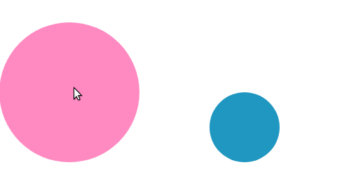

# Animations - Exercise #3 - The ball collision

Please realize the following collision on the boxes:

Realize the colission effect by applying an ease-in on one and the  ease-out timing-function on the other ball.

Find all detailed instructions in the index.html
