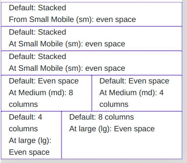
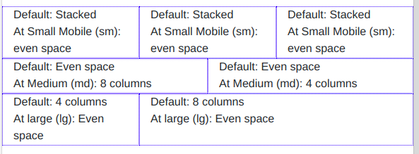
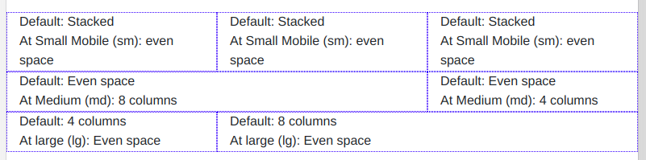

# Bootstrap - Exercise #4 - Responsive columns

## Instructions

- Create a grid like in the images below
- Create it "mobile first" (= create the mobile column setup first)
- Then add the column settings for the other devices (sm, md and lg)
- Make the grid container fluid

Mobile first (=extra small mobile) / default:

(=> watch out: the first three elements are all part of one row!)

Small mobile (sm):

Tablet (md):

Desktop (lg):

Guidance on the bootstrap grid system, breakpoints and visual examples:

- Grid-System & Breakpoints: <https://getbootstrap.com/docs/4.3/layout/grid/>
- Grid-Examples (visual): <https://getbootstrap.com/docs/4.3/examples/grid/>
