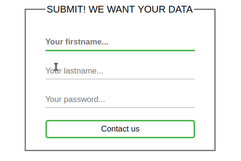

# Basic Data Exercises

## Exercise: Form 2

**Instructions**:

- Style the form like seen in the mockup image below
  - Make the input fields without border and transparent
  - Make the button transparent + slighlty rounded green border
- On selecting / focussing an input
  - Make the placeholder bold
  - Restyle the bottom border of the div
    - Use the :focus-within selector to select the div
- The base color for the form lines is: #4caf50
- Find the detailed instructions in the index.html file

Advanced Task:

- Style the underlines with an animation (like seen below)
- Tip: Use a empty element or pseudo element for the line. It has 0 width at the beginning and expand it to 100% width

