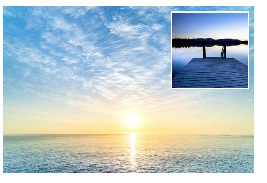

# Exercise #3 Positioning - Picture within picture

In the given index.html you find 2 divs. Each with a background image.

Please position the second image within its parent like in the image below. Apply relative & absolute positioning together.

