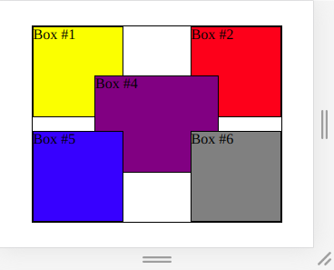
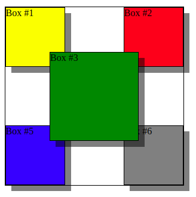
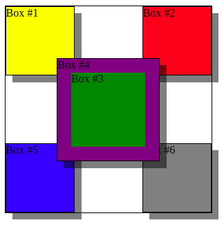

# Exercise Positioning - Z-Index #1

Open the given html file in the browser.

It currently shows a layering of boxes like this:

The green Box 3 is here totally hidden by its child Box 4.

We now want to get to this layering of boxes:

The main differences to realize in the result:

- the boxes have shadows (not blurred)
- the sub-container box (containing the boxes 3 and 4) needs to be on top of all other boxes
- the hidden box 3 (green) needs to be placed on top of its child box 4 (by default the child goes on top of its parent)

Advanced Task (not mandatory):

Make the purple child box extend the boundaries of its parent by 20px like seen in the image below. The green box shrinks accordingly by 20px.

