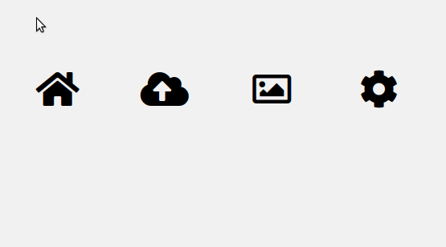

# Exercise # Positioning - the tooltip menu

Within the given file index.html you find a menu with four menu boxes.

Each menu box consists of one fontawesome icon + an icon label (within the span tag).

Please adjust the css so that the icon label is hidden by default and is shown by hovering over the icon.

Additionally: Place a small triangle shape on top of the span. Use a pseudo element for that and position it absolutely. Please use a rotated square to realize it.

Apply a z-index when necessary :)

Result on hovering over an icon:

Pro task:

Instead of using the predefined index.html you can use the index-no-css.html file as boilerplate. This contains just the HTML with icons, no styling. Style the complete menu on your own / from scratch.
