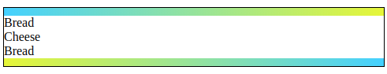

# Exercise #3 - Pseudo Elements

## The gradient borders

In the index.html you find two divs. Each div has a sandwhich class attached.

Style each "sandwich div" with two linear gradient "borders", one at the top, one at the bottom like seen in the image below.

Apply pseudo elements ::before and ::after for that.

Tip: These borders are not REAL borders. Make the pseudo elements block level elements with width and height and give them a linear gradient as background. The top and bottom gradients should alternate in direction.

See detailed instructions in the index.html file.
