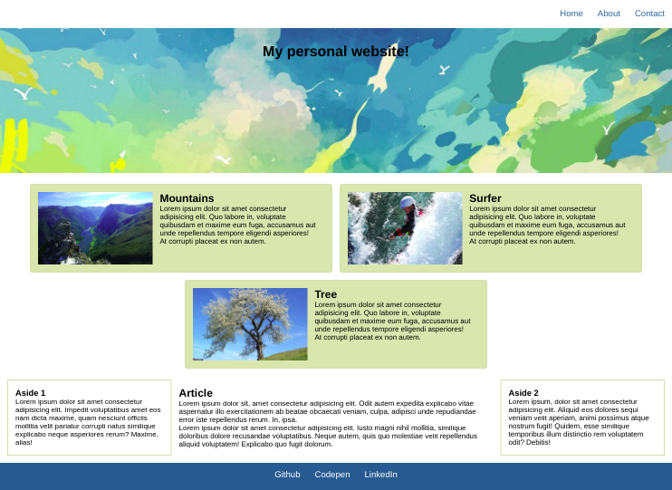

# SCSS Nesting - Exercise #2

Make the given HTML page responsive like seen in the images below.

In the given CSS file you find some base styles.

## Step 1: Conversion

Convert the given css file - which has some base styles - to SCSS.

## Step 2: Images

Place background images in the corresponding classes. And make them cover their containers.

## Step 3 Variables

Outsource some often repeating styles to variables. Put the variable definitions at the top of the SCSS file.

Please do not put flexbox styles into variables. Just basic styles & font-family or repeated base styles like padding, margin or height.

## Step 4 Nesting

Nest all child selectors - where possible - into parent selectors.

## Step 5 Implement responsiveness

- Design for mobile first!
- Analyse the image cards by resizing the browser: What kind of structure do we have here? Try to make it clear for you before starting to style the image cards
- Fill the media queries to change the stylings at the given breakpoints

```
Mobile: < 768px
Tablet breakpoint: 768px
Desktop breakpoint: 1024px
```

Mobile:


Tablet:


Desktop:



You find the used images for the header and cards in the folder "images_website".
