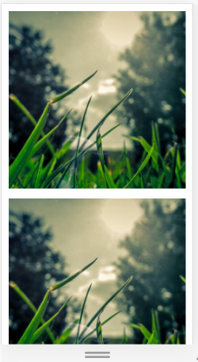
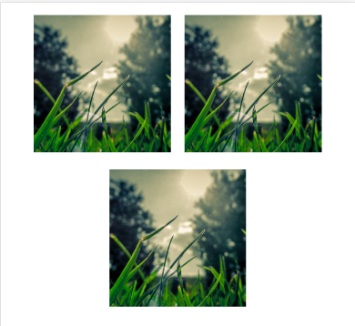
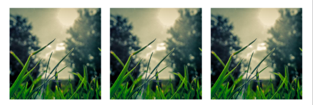

# SCSSS Mixins - Exercise #2 - Media Queries

In the HTML file we got a main tag with three sections.

Each section contains some random image from unsplash.it.

## Instructions

Make the image sections responsive like seen in the images below:

- Create an style.scss file
- Setup two media query mixins: One is called "tablet" and the other "desktop"
- On the breakpoints: Change the flexbox behaviour
  - Stacked sections on mobile (default)
  - Wrapping sections on tablet
  - All next to each other on desktop
- Keep in mind that you have to either set width or flex-basis on the flexbox children in order to limit their size in percent. Otherwise they will be greedy, taking as much space as possible.

Mobile View (500px):

Tablet View:

Desktop View:

