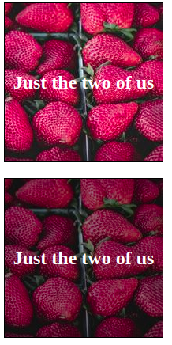

# Exercise #2 - Text on image

Please use the file index.html and fill the two boxes with two images from unsplash.

The first box should have no color filter at all, just the unsplash image.
The second box should get multiple backgrounds, the unsplash image + a transparent black linear-gradient at the top.

Please find the detailed instructions in the file in the file index.html (CSS comments).

Please compare at the end the readability of the box texts by refreshing the browser several times, loading different images.

The result:

